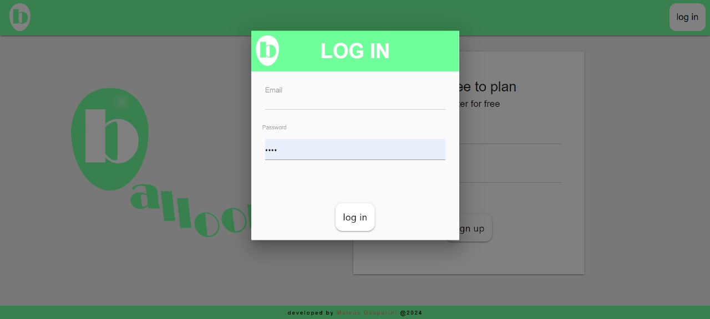

<h1 align='center'>Ballons</h1>
<h3 align='center'>fell free to plan</h3>

 ballons is a holiday planning website, it's the best solution to organize your events and don't forget any details.
 

 With Balloons, you will be able to:

- Create events and holidays
- Add descriptions and details to your events
- Keep track of your events with the callendar
- Download a PDF file of your events

<h1 align='center'>Walkthrough</h1>
<h3 align='center'>now to a guide of the website</h3>

<h2>INDEX</h2>

 The index is the first page when you access the website, it is through this that you will create a new account, and also access your existing account 
 

<h3>PC</h3>

 
 

<h3>Mobile</h3>

 
 

<h2>MY HOLIDAYS</h2>

 At the "My Holidays" page, you can create and edit the events you desire. With easy access e light design, it's very easy to edit the events and add all the details neccesary 
 

<h3>PC</h3>

 
 

