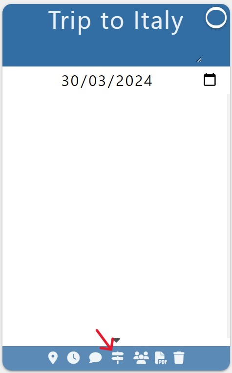

<h1 align='center'>Ballons</h1>
<h3 align='center'>fell free to plan</h3>

 ballons is a holiday planning website, it's the best solution to organize your events and don't forget any details.
 

 With Balloons, you will be able to:

- Create events and holidays
- Add descriptions and details to your events
- Keep track of your events with the callendar
- Download a PDF file of your events

<h1 align='center'>Walkthrough</h1>
<h3 align='center'>now to a guide of the website</h3>

<h2>INDEX</h2>

 The index is the first page when you access the website, it is through this that you will create a new account, and also access your existing account 
 

<h3>PC</h3>

 
 

<h3>Mobile</h3>

 
 

<h2>MY HOLIDAYS</h2>

 At the "My Holidays" page, you can create and edit the events you desire. With easy access e light design, it's very easy to edit the events and add all the details neccesary 
 

<h3>PC</h3>

<h2>CHANGING THE HOLIDAYS</h2>

 If you're unpleased with the name, date and color of the event you just added, don't delete it, just click and change. 
 

<h2>Addons</h2>

 The addons are the events details tha you're able to use in your planning, the available addons are: 

- Time
- Location
- Description
- Transport
- Guests

 In complement with those addons, the user also have two other options: 

- PDF (download a pdf file of the event)
- Delete (delete the event)

 The addons are located at the bottom of the event card. Below, you see the process of adding a transport and a description into a event 

 
 
 
 
 
 
 

 As you can see, just click and edit, as you wish 

<h2>Guests</h2>

 You can also add a guest list to your event, the step by step below shows how: 

    
    
    
    

<h2>CALLENDAR</h2>

 The "Callendar" page is the perfect solution to keep track of your events and don't lose any important details. 

 The minimized version is used to see the agenda, while the maximized version is used to see the events details. To use the maximized version, just click ate the day intended 
 

<h3>PC</h3>

    
    

<h3>Mobile</h3>

    
    

